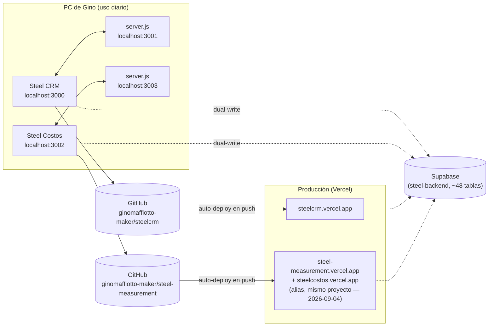

# Arquitectura — Steel Platform (Steel CRM · Steel Costos · steel-backend)

**Para:** cualquier sesión de Claude Code trabajando en los tres repos, y
como base directa para el manual de instalación y la descripción técnica
que se están armando en el chat de documentación.
**De:** sesión de documentación (`steelCRM - BUILDIING` → `SteelPlatform`)
**Fecha:** 2026-08-25, actualizado 2026-09-25
**Fuente:** relevado contra el código real — `package.json`, `server.js`,
`api/`, `public/`, launchers, y remotos git de los tres repos. No
reconstruido de memoria/changelog. Complementa a `ENTIDADES-COMPARTIDAS.md`
(qué datos existen y cómo se relacionan) — este documento cubre **cómo está
armado el software que los mueve**.

---

## 1. Los tres repos y cómo encajan



`steel-backend` no es una app — es solo `supabase/migrations/`, aplicadas
con el CLI de Supabase directo al proyecto real (`project ref:
lnblgecgskjyulbqocet`, São Paulo). No tiene remoto de GitHub ni deploy
propio.

---

## 2. Stack técnico (idéntico en Steel CRM y Steel Costos)

- **Frontend**: React 19 + Create React App (`react-scripts` 5.0.1) — sin
  router de terceros, un solo `App.js` que decide qué `.jsx` de
  `src/components/` mostrar según pestaña activa.
- **Sin framework de backend propio**: `server.js` usa únicamente los
  módulos nativos de Node (`http`, `https`, `fs`, `path`) — cero
  `express`/`fastify`/etc. Es un proxy de ~150 líneas, no una API.
- **`@supabase/supabase-js`** como único cliente de base de datos —
  `src/utils/supabaseClient.js` (cliente principal, persiste sesión) y
  `src/utils/verificarPassword.js` (cliente descartable, `persistSession:
  false`, para verificar una contraseña sin pisar la sesión activa de quien
  esté logueado — usado por el flujo de borrado con confirmación).
- **Sin TypeScript, sin CSS-in-JS de terceros** — estilos inline + un mapa
  de temas (`src/styles/colors.js`, `THEMES`: `industrial_dark`/
  `metalsales_light`, ver §6 de `ENTIDADES-COMPARTIDAS.md` para cómo se
  relaciona con RLS... no aplica, es solo UI, no dato).

---

## 3. Estructura de carpetas (mismo patrón en los dos repos)

```
steelcrm/  (o steel-measurement/)
├── src/
│   ├── App.js              — estado raíz, handlers centrales, ruteo por pestaña
│   ├── components/         — un .jsx por módulo/pantalla (ver lista abajo)
│   ├── utils/
│   │   ├── storage.js      — loadLS/saveLS (local) + loadDB/saveDB (Supabase)
│   │   ├── helpers.js/calculos.js  — lógica de negocio pura
│   │   ├── supabaseClient.js       — cliente Supabase principal
│   │   └── pdfPresupuesto.js       — generación de PDF (código compartido 1:1 entre los dos repos)
│   └── styles/colors.js    — temas
├── public/                 — manifest.json, service-worker.js, íconos PWA
├── api/                    — funciones serverless (Vercel), ver tabla abajo
├── vercel.json             — solo en steelcrm (cron diario de backup, ver §5/§6)
├── server.js               — proxy local (IA, backup viejo, cotización) — SOLO corre en local, no en Vercel
└── Iniciar*.ps1 / *.bat    — launchers de escritorio
```

**Funciones serverless reales hoy** (`api/`, 2026-09-11 — creció bastante
desde que solo existía `cotizacion.js`):

| Función | steelcrm | Steel Costos | Nota |
|---|---|---|---|
| `cotizacion.js` | ✅ | ✅ | Scraping BROU, código idéntico en los dos. |
| `claude.js` | ✅ | — | Proxy de IA — Steel Costos no usa la API de Claude. |
| `invitar-usuario.js` | ✅ | ✅ | 2026-09-03/04. Valida token de sesión + rol admin contra `profiles` con la `service_role key`, nunca en el browser. |
| `eliminar-usuario.js` | ✅ | ✅ | Mismo patrón, revoca con `auth.admin.deleteUser`. |
| `backup-cron.js` | ✅ | — | 2026-09-04. Cubre los DOS sistemas en una sola pasada (comparten backend) — no hace falta uno por repo. Disparado por el cron de Vercel (`vercel.json`) o a pedido manual con token de admin. |
| `backup-status.js` | ✅ | ✅ | Lectura de solo estado, mismo bucket de Storage compartido. |

**Tamaño real de los archivos más grandes** (líneas, actualizado 2026-09-25):

| Repo | Archivo | Líneas |
|---|---|---|
| steelcrm | `src/components/shared.jsx` | 3579 |
| steelcrm | `src/App.js` | 1822 |
| steelcrm | `src/components/Config.jsx` | 1720 |
| steelcrm | `src/utils/storage.js` | 1215 |
| steelcrm | `src/components/CerebroNegocio.jsx` | 994 |
| steel-measurement | `src/components/Presupuesto.jsx` | 3780 |
| steel-measurement | `src/components/BibliotecaMateriales.jsx` | 2459 |
| steel-measurement | `src/components/Anidado.jsx` | 2112 |
| steel-measurement | `src/utils/storage.js` | 1799 |
| steel-measurement | `src/components/Computo.jsx` | 1868 |

(`historialSeed.js` 8231 líneas y `presupuestosHistoricosSeed.js` 25078
líneas en Steel Costos son datos semilla, no lógica — no cuentan como
deuda técnica de código.)

**Módulos de Steel CRM** (`src/components/`, 19 archivos — sube de 18 con
`Empresas.jsx`, 2026-09-06, ficha de empresa que faltaba en esta tabla
desde que la entidad existe): Inicio, Presupuestos, Clientes, Kanban,
Dashboard, Seguimientos, Historial, Solicitudes, Obras, Aceptados,
Empresas, Competencia, Forecast, Bonificaciones, CerebroNegocio,
Calculadora, Config, Importar, `shared.jsx` (componentes compartidos
entre módulos: `BudgetModal`, `ComentariosThread`, `ExportModal`, etc.).

**Módulos de Steel Costos** (`src/components/`, 22 archivos):
BibliotecaMateriales, Computo, Anidado, Presupuesto, Historial, Dashboard,
Config, Buscador, FiltrosBar, ComentariosPanel, Toast, ConfirmarEliminar,
AutocompleteCliente, AutocompleteEmpresa, SolicitudesAsignadas (2026-08-26
— lee `solicitudes` directo de Steel CRM, ver `ENTIDADES-COMPARTIDAS.md`
§6), y 5 más agregados 2026-08-29/30 junto con Empresa como entidad real:
AutocompleteObra, ClienteRapidoModal, ObraRapidaModal, EmpresaRapidaModal
(los 3 modales "alta rápida" — mismo patrón que ya usaba Cliente, ahora
también para Obra y Empresa) y Combobox (extraído como componente
compartido durante ese mismo trabajo). `FichaSolicitud.jsx` (2026-09-12/14)
— componente dual: solo lectura cuando lo usa el Buscador Global (muestra
solicitudes de todo el tenant), editable (ver/crear/editar con alta
rápida de Cliente/Obra/Empresa y candado de dueño) cuando lo usa "Mis
solicitudes asignadas" — reemplaza al modal de alta que tenía antes.
`ExportModal.jsx` (2026-09-13) — Steel Costos no tenía ningún export
general hasta esa fecha (solo la lista de corte de Anidado, un `.txt`
plano); nuevo modal con 4 hojas (Cómputos/Anidados/Presupuestos/
Historial) a Excel o Google Sheets, portado del mismo mecanismo que ya
tenía Steel CRM — ver `INTEGRACIONES-COMPARTIDAS.md` §3.

**Tests automatizados (nuevo, 2026-09-07, crecido bastante desde
entonces)** — hasta esa fecha, toda verificación de este proyecto era
manual/en vivo (ver el patrón repetido en el changelog narrativo de cada
repo: "el build limpio no alcanza para bugs de datos reales"). Con
`react-scripts test` (Jest, ya incluido por Create React App, sin
configuración nueva): steelcrm — ~76 tests, sumó auditoría geométrica del
catálogo de materiales (recalcula kg/m real por sección×densidad para
252 filas del catálogo), calibración de Forecast (`calibrarProbabilidadesBase`,
10 tests), recálculo de 3 vías Kgs↔U$S/kg↔Monto (13 tests, funciones
extraídas de `shared.jsx` a `utils/calculos.js`) y escalones de
Bonificaciones (15 tests); Steel Costos — ~48 tests, sumó `run2DFFD`
(nesteo 2D de planchas — test de regresión que compara contra una copia
congelada del algoritmo viejo) y `mutateComputo` (test de regresión
contra el bug real de piezas perdidas al editar dos campos seguidos sin
re-render entre medio, 2026-09-13/14). Ambos cubren específicamente
funciones que ya causaron bugs reales una vez (ej. `siguienteNroComputo`:
el bug de número de cómputo duplicado del 24/8; `runFFD`/`run2DFFD`: los
algoritmos de anidado). No reemplazan la verificación en vivo con datos
reales — la complementan para lógica pura que no depende de Supabase/DOM.

---

## 4. Persistencia, sync y autenticación

Cubierto en detalle en `ENTIDADES-COMPARTIDAS.md` §1, §2, §7 y §8 — no se
repite acá. Resumen de una línea: **localStorage es la fuente de verdad**,
cada guardado dispara un dual-write a Supabase que nunca bloquea, Fase 5
completa lo que falte desde la nube al montar la app, y todo está aislado
por `tenant_id` vía RLS + Supabase Auth (`profiles`) — desde 2026-09-03,
un segundo nivel de RLS ("candado de dueño") también restringe por
propiedad en 7 tablas más sensibles (`ENTIDADES-COMPARTIDAS.md` §8), y
desde 2026-09-04 `profiles.acceso_crm`/`acceso_costos` controla el acceso
a cada producto por separado — desde 2026-09-12 también con policies
RESTRICTIVE de RLS, no solo en el cliente (`ENTIDADES-COMPARTIDAS.md` §8).

**Sesión restaurada, revalidada al montar (fix real, 2026-09-20)**: hasta
esa fecha, `App.js` restauraba la sesión desde `sessionStorage`/caché
local sin más al recargar la página — un riesgo teórico documentado desde
el 2026-08-24 ("la UI podría mostrarse logueada sin revalidar que el
token de Supabase siga vigente"), confirmado real varias veces en
septiembre (RLS rechazando escrituras con "row-level security policy"
mientras la pantalla seguía mostrando al usuario como logueado — ej. al
usar "☁️ Enviar a Steel CRM" con la sesión ya vencida). Ahora la sesión
restaurada siempre se revalida contra Supabase (`getSession()`) al
montar la app, en vez de darse por buena — cierra el gap del todo.

---

## 5. Integraciones externas

| Integración | Cómo funciona | Local | Producción |
|---|---|---|---|
| **IA (Claude, `claude-haiku-4-5-20251001`)** | Proxy que agrega el header `x-api-key` server-side — la key nunca vive en el browser. | ✅ `server.js` expone `POST /api/claude` en `localhost:3001` (steelcrm). | ✅ `api/claude.js` (función serverless, commit `2bfa1ef`) — ver §7 para el detalle y un bug distinto que sigue abierto en un módulo puntual. |
| **Cotización BROU** | `server.js`/`api/cotizacion.js` hacen el mismo POST que la página pública del BROU a un portlet de Liferay (scraping, sin API oficial — riesgo conocido y documentado en el propio código: si el BROU rediseña la página, deja de funcionar). Steel CRM la muestra como referencia; Steel Costos la usa para autocompletar el tipo de cambio de cada presupuesto. | ✅ `localhost:3001` (steelcrm) / `localhost:3003` (Steel Costos). | ✅ `api/cotizacion.js` (función serverless, mismo código de scraping) en los dos repos. |
| **Backup automático — server-side, real desde 2026-09-04** | Reemplaza por completo al mecanismo viejo (`server.js` a disco local, que en la práctica **nunca corrió en producción** — hallazgo real: `steelcrm.vercel.app` nunca disparó un backup exitoso desde que existe, el cartel de "atrasado" quedaba atrasado para siempre sin que nadie lo notara). Ahora: bucket privado `backups` en Supabase Storage + función `tablas_con_tenant_id()` (descubre las tablas a respaldar dinámicamente, sin lista fija a mano) + `api/backup-cron.js` (steelcrm — cubre los dos sistemas en una sola pasada, ya que comparten backend) con cron diario de Vercel (`vercel.json`, 06:00 UTC) o disparo manual con token de admin. Purga automática a 30 días. `api/backup-status.js` (copia en los dos repos) hace la lectura de solo estado. | ✅ el botón "Backup ahora" de Config llama a la misma función. | ✅ — a diferencia del mecanismo viejo, este sí corre en producción (es justamente para lo que se construyó). |
| **Google Drive (backup opcional)** | `src/utils/googleDrive.js` — OAuth (Google Identity Services) + `drive.file` scope. **Desde 2026-09-04, en los dos sistemas** (antes solo Steel CRM — cerraba una asimetría documentada desde el 25/8 en `INTEGRACIONES-COMPARTIDAS.md`) — sube/baja el backup como `.json`. | ✅ funciona igual en cualquier origen (no depende de `server.js`). | ✅ (necesita un Client ID real de Google Cloud Console, sin probar de punta a punta todavía del lado de Steel Costos). |
| **Google Sheets (export en vivo, 2026-09-12/13, los dos sistemas)** | `src/utils/googleDrive.js` — reusa el mismo token/scope `drive.file` que ya tenía autorizado el backup a Drive (sin pedir un consentimiento nuevo). Botón "Google Sheets" en `ExportModal` crea o actualiza una hoja real; el `spreadsheetId` queda guardado en Config (`tenant_settings`) para reusar la misma hoja entre dispositivos en vez de crear una nueva cada vez. Steel Costos porta el mecanismo 1:1 un día después, junto con su primer `ExportModal.jsx` propio (antes no tenía ningún export general). | ✅ | ✅ |
| **Invitación / eliminación de usuarios por email** | `api/invitar-usuario.js`/`api/eliminar-usuario.js` (2026-09-03/04, en los dos repos) — reemplazan el flujo viejo de generar un comando `crear-usuario.mjs` para pegar a mano en una terminal. Validan el token de sesión real + rol admin contra `profiles` server-side, con la `service_role key` (nunca en el browser); el cliente le pega siempre a la URL de producción del sistema correspondiente, sea que la sesión corra local o no. CORS explícito (`localhost` + dominio de producción) por header `Authorization` custom + preflight `OPTIONS`. | ✅ (llamando a la función de producción) | ✅ |
| **Monitoreo de errores (Sentry)** | 2026-09-07, en los dos sistemas — `utils/sentry.jsx` + `Sentry.ErrorBoundary` envolviendo `<App/>`, con pantalla de resguardo si React se cae del todo. Gatea todo por `REACT_APP_SENTRY_DSN` — sin esa variable, no hace nada (build limpio y funcional sin ella). Verificado en vivo en producción en los dos proyectos reales de Sentry (`STEEL-CRM-1`, `STEEL-COSTOS-1`). | ✅ (si `.env.local` tiene el DSN) | ✅ |
| **Supabase Auth** | Login real por email/contraseña, reemplaza la selección de usuario local. Una sola cuenta sirve para los dos sistemas (mismo backend). | ✅ | ✅ |

---

## 6. Despliegue

**Local (uso diario)**: doble click en el launcher de escritorio
(`IniciarSteelCRM_Oculto.bat` / `Iniciar Steel Costos.bat`) →
`.ps1` oculto (`-WindowStyle Hidden`) → arranca `server.js` y `npm start`
como procesos ocultos → hace polling de puerto contra `127.0.0.1` hasta que
responde → abre el navegador en `http://localhost:3000` (Steel CRM) /
`:3002` (Steel Costos) explícitamente en `localhost`, nunca en
`127.0.0.1` — son **orígenes distintos** para el browser (con
`localStorage` separado); confundirlos fue la causa de un bug real de
"datos perdidos" el 23/8 (ver `PLAN.md` / changelog de esa fecha).

**Producción**: proyectos Vercel (`steelcrm`, `steel-measurement`)
conectados por `vercel git connect` a sus respectivos repos de GitHub —
**cualquier push a `master` dispara un deploy automático**, no hace falta
correr `vercel --prod` a mano. Ambos públicos (protección real es Supabase
Auth + RLS, no algo de Vercel). El proyecto `steel-measurement` de Vercel
tiene, desde 2026-09-04, un segundo dominio (`steelcostos.vercel.app`,
agregado sin sacar el original) — son el mismo deploy, pero **orígenes
distintos para el navegador** (PWA instalada desde uno no se entera del
otro; hay que reinstalar desde el dominio nuevo para que el ícono/nombre
digan "Steel Costos").

**Variables de entorno reales en Vercel** (Project Settings > Environment
Variables), por proyecto:

| Variable | steelcrm | Steel Costos | Nota |
|---|---|---|---|
| `REACT_APP_SUPABASE_URL` / `REACT_APP_SUPABASE_ANON_KEY` | ✅ | ✅ | |
| `SUPABASE_SERVICE_ROLE_KEY` | ✅ | ✅ | Server-only (`api/`), nunca llega al bundle del cliente — usada por invitar/eliminar usuario y por el backup. |
| `CRON_SECRET` | ✅ | — | Solo en steelcrm — el cron de backup vive ahí. Secreto interno de la app, no una key de terceros. |
| `REACT_APP_SENTRY_DSN` | ✅ | ✅ | Público por diseño (viaja en el bundle del browser, mismo criterio que la anon key) — sin riesgo si se comparte. |

**PWA**: los dos sistemas son instalables (manifest + service worker +
íconos PNG 192/512 reales, requisito de Chrome — un manifest con solo SVG
no alcanza). Confirmado visualmente por Gino en los dos.

---

## 7. IA de Steel CRM en producción

### ✅ Bug de URL — corregido (2026-08-25, commit `2bfa1ef`, sesión `-79_CRM`)

Las 6 funciones de IA de Steel CRM (`Inicio.jsx`, `Calculadora.jsx`,
`shared.jsx` ×2, `Historial.jsx` ×2, `CerebroNegocio.jsx`,
`Competencia.jsx` — 8 call-sites en total) llamaban todas
`fetch("http://localhost:3001/api/claude", …)` **hardcodeado**, sin el
mismo patrón de hostname que ya tenía `/api/cotizacion`. No existía ningún
`api/claude.js` en la carpeta `api/` de steelcrm — nadie había construido
la versión serverless de este proxy, a diferencia de cotización.
**Resultado hasta hoy: nadie podía usar IA en `steelcrm.vercel.app`.**

Corregido: `api/claude.js` nuevo (mismo patrón que `api/cotizacion.js`,
agrega `x-api-key` server-side) + los 8 call-sites con
`if (hostname === "localhost") … else "/api/claude"`. Verificado con
`curl` contra producción — la función responde (400 "API key no
configurada" en vez de 404, o sea que ya está viva y corriendo).

### ✅ Bug de formato en `Inicio.jsx` — corregido (2026-08-25, commit `5ae70bd`, sesión `-79_CRM`)

Encontrado de paso al aplicar el fix de arriba — **no relacionado con la
URL**, ya estaba roto en local antes de ese fix. El asistente IA de
`Inicio.jsx` (dashboard, resumen de acciones sugeridas) mandaba el body
`{ prompt }` en lugar del formato real que espera `server.js`/`api/claude.js`
y, por debajo, la API de Anthropic (`{ _apiKey, model, max_tokens,
messages: [...] }`), y leía `d.respuesta`/`d.response` — campos que no
existen en la forma real de la respuesta (`content[0].text`). Los otros 5
módulos de IA ya armaban el body correcto — era un bug aislado a este
único componente.

Corregido a pedido de Gino: ahora manda `{ _apiKey, model, messages }` y
lee `d.content?.[0]?.text`, mismo patrón que el resto. Build limpio; sin
prueba en vivo todavía (necesita una API key real cargada en Config > IA)
— pendiente de que alguien con esa key configurada lo confirme en el
navegador.

---

## 8. Mantenimiento de este documento

Misma Regla 9 que `ENTIDADES-COMPARTIDAS.md` (ver esa sección §8): toda
sesión que cambie el stack, la estructura de carpetas, una integración
externa o el mecanismo de despliegue de cualquiera de los tres repos
actualiza este documento en el mismo commit.
