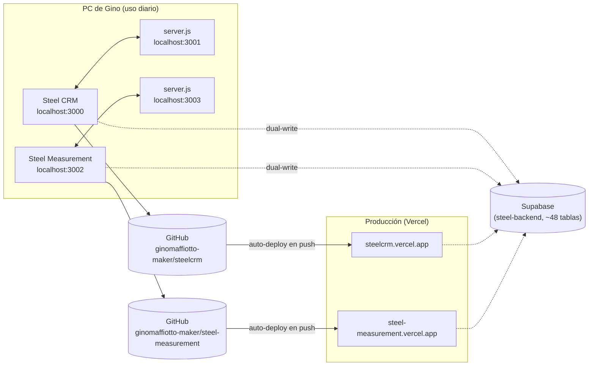

# Arquitectura — Steel Platform (Steel CRM · Steel Measurement · steel-backend)

**Para:** cualquier sesión de Claude Code trabajando en los tres repos, y
como base directa para el manual de instalación y la descripción técnica
que se están armando en el chat de documentación.
**De:** sesión de documentación (`steelCRM - BUILDIING`)
**Fecha:** 2026-08-25
**Fuente:** relevado contra el código real — `package.json`, `server.js`,
`api/`, `public/`, launchers, y remotos git de los tres repos. No
reconstruido de memoria/changelog. Complementa a `ENTIDADES-COMPARTIDAS.md`
(qué datos existen y cómo se relacionan) — este documento cubre **cómo está
armado el software que los mueve**.

---

## 1. Los tres repos y cómo encajan



`steel-backend` no es una app — es solo `supabase/migrations/`, aplicadas
con el CLI de Supabase directo al proyecto real (`project ref:
lnblgecgskjyulbqocet`, São Paulo). No tiene remoto de GitHub ni deploy
propio.

---

## 2. Stack técnico (idéntico en Steel CRM y Steel Measurement)

- **Frontend**: React 19 + Create React App (`react-scripts` 5.0.1) — sin
  router de terceros, un solo `App.js` que decide qué `.jsx` de
  `src/components/` mostrar según pestaña activa.
- **Sin framework de backend propio**: `server.js` usa únicamente los
  módulos nativos de Node (`http`, `https`, `fs`, `path`) — cero
  `express`/`fastify`/etc. Es un proxy de ~150 líneas, no una API.
- **`@supabase/supabase-js`** como único cliente de base de datos —
  `src/utils/supabaseClient.js` (cliente principal, persiste sesión) y
  `src/utils/verificarPassword.js` (cliente descartable, `persistSession:
  false`, para verificar una contraseña sin pisar la sesión activa de quien
  esté logueado — usado por el flujo de borrado con confirmación).
- **Sin TypeScript, sin CSS-in-JS de terceros** — estilos inline + un mapa
  de temas (`src/styles/colors.js`, `THEMES`: `industrial_dark`/
  `metalsales_light`, ver §6 de `ENTIDADES-COMPARTIDAS.md` para cómo se
  relaciona con RLS... no aplica, es solo UI, no dato).

---

## 3. Estructura de carpetas (mismo patrón en los dos repos)

```
steelcrm/  (o steel-measurement/)
├── src/
│   ├── App.js              — estado raíz, handlers centrales, ruteo por pestaña
│   ├── components/         — un .jsx por módulo/pantalla (ver lista abajo)
│   ├── utils/
│   │   ├── storage.js      — loadLS/saveLS (local) + loadDB/saveDB (Supabase)
│   │   ├── helpers.js/calculos.js  — lógica de negocio pura
│   │   ├── supabaseClient.js       — cliente Supabase principal
│   │   └── pdfPresupuesto.js       — generación de PDF (código compartido 1:1 entre los dos repos)
│   └── styles/colors.js    — temas
├── public/                 — manifest.json, service-worker.js, íconos PWA
├── api/cotizacion.js       — función serverless (Vercel) — scraping BROU en producción
├── server.js               — proxy local (IA, backup, cotización) — SOLO corre en local, no en Vercel
└── Iniciar*.ps1 / *.bat    — launchers de escritorio
```

**Tamaño real de los archivos más grandes** (líneas, 2026-08-25) — útil para
saber dónde un cambio va a doler más:

| Repo | Archivo | Líneas |
|---|---|---|
| steelcrm | `src/components/shared.jsx` | 1903 |
| steelcrm | `src/components/Config.jsx` | 1581 |
| steelcrm | `src/App.js` | 1356 |
| steelcrm | `src/components/CerebroNegocio.jsx` | 1009 |
| steelcrm | `src/utils/storage.js` | 957 |
| steel-measurement | `src/components/BibliotecaMateriales.jsx` | 2105 |
| steel-measurement | `src/components/Presupuesto.jsx` | 2048 |
| steel-measurement | `src/components/Computo.jsx` | 1464 |
| steel-measurement | `src/utils/storage.js` | 1454 |
| steel-measurement | `src/components/Anidado.jsx` | 1253 |

(`historialSeed.js` 8231 líneas y `presupuestosHistoricosSeed.js` 25078
líneas en Steel Measurement son datos semilla, no lógica — no cuentan como
deuda técnica de código.)

**Módulos de Steel CRM** (`src/components/`, 18 archivos): Inicio,
Presupuestos, Clientes, Kanban, Dashboard, Seguimientos, Historial,
Solicitudes, Obras, Aceptados, Competencia, Forecast, Bonificaciones,
CerebroNegocio, Calculadora, Config, Importar, `shared.jsx` (componentes
compartidos entre módulos: `BudgetModal`, `ComentariosThread`, `ExportModal`, etc.).

**Módulos de Steel Measurement** (`src/components/`, 15 archivos):
BibliotecaMateriales, Computo, Anidado, Presupuesto, Historial, Dashboard,
Config, Buscador, FiltrosBar, ComentariosPanel, Toast, ConfirmarEliminar,
AutocompleteCliente, AutocompleteEmpresa, SolicitudesAsignadas (nuevo,
2026-08-26 — lee `solicitudes` directo de Steel CRM, ver
`ENTIDADES-COMPARTIDAS.md` §6).

---

## 4. Persistencia, sync y autenticación

Cubierto en detalle en `ENTIDADES-COMPARTIDAS.md` §1, §2 y §7 — no se
repite acá. Resumen de una línea: **localStorage es la fuente de verdad**,
cada guardado dispara un dual-write a Supabase que nunca bloquea, Fase 5
completa lo que falte desde la nube al montar la app, y todo está aislado
por `tenant_id` vía RLS + Supabase Auth (`profiles`).

---

## 5. Integraciones externas

| Integración | Cómo funciona | Local | Producción |
|---|---|---|---|
| **IA (Claude, `claude-haiku-4-5-20251001`)** | Proxy que agrega el header `x-api-key` server-side — la key nunca vive en el browser. | ✅ `server.js` expone `POST /api/claude` en `localhost:3001` (steelcrm). | ✅ `api/claude.js` (función serverless, commit `2bfa1ef`) — ver §7 para el detalle y un bug distinto que sigue abierto en un módulo puntual. |
| **Cotización BROU** | `server.js`/`api/cotizacion.js` hacen el mismo POST que la página pública del BROU a un portlet de Liferay (scraping, sin API oficial — riesgo conocido y documentado en el propio código: si el BROU rediseña la página, deja de funcionar). Steel CRM la muestra como referencia; Steel Measurement la usa para autocompletar el tipo de cambio de cada presupuesto. | ✅ `localhost:3001` (steelcrm) / `localhost:3003` (Steel Measurement). | ✅ `api/cotizacion.js` (función serverless, mismo código de scraping) en los dos repos. |
| **Backup automático** | `server.js` escribe `backups/backup_<fecha>.json` a disco y purga lo de más de 30 días. Por diseño, solo tiene sentido con un proceso local con disco propio. | ✅ `POST /api/backup`, `localhost:3001`. | — (no aplica; Config avisa si pasaron >3 días sin backup exitoso). |
| **Google Drive (backup opcional)** | `src/utils/googleDrive.js` — OAuth (Google Identity Services) + `drive.file` scope, sube/baja `steelcrm_backup.json`. Solo Steel CRM. | ✅ funciona igual en cualquier origen (no depende de `server.js`). | ✅ |
| **Supabase Auth** | Login real por email/contraseña, reemplaza la selección de usuario local. Una sola cuenta sirve para los dos sistemas (mismo backend). | ✅ | ✅ |

---

## 6. Despliegue

**Local (uso diario)**: doble click en el launcher de escritorio
(`IniciarSteelCRM_Oculto.bat` / `Iniciar Steel Measurement.bat`) →
`.ps1` oculto (`-WindowStyle Hidden`) → arranca `server.js` y `npm start`
como procesos ocultos → hace polling de puerto contra `127.0.0.1` hasta que
responde → abre el navegador en `http://localhost:3000` (Steel CRM) /
`:3002` (Steel Measurement) explícitamente en `localhost`, nunca en
`127.0.0.1` — son **orígenes distintos** para el browser (con
`localStorage` separado); confundirlos fue la causa de un bug real de
"datos perdidos" el 23/8 (ver `PLAN.md` / changelog de esa fecha).

**Producción**: proyectos Vercel (`steelcrm`, `steel-measurement`)
conectados por `vercel git connect` a sus respectivos repos de GitHub —
**cualquier push a `master` dispara un deploy automático**, no hace falta
correr `vercel --prod` a mano. Ambos públicos (protección real es Supabase
Auth + RLS, no algo de Vercel). Variables de entorno `REACT_APP_SUPABASE_URL`
/`REACT_APP_SUPABASE_ANON_KEY` cargadas en el proyecto de Vercel.

**PWA**: los dos sistemas son instalables (manifest + service worker +
íconos PNG 192/512 reales, requisito de Chrome — un manifest con solo SVG
no alcanza). Confirmado visualmente por Gino en los dos.

---

## 7. IA de Steel CRM en producción

### ✅ Bug de URL — corregido (2026-08-25, commit `2bfa1ef`, sesión `-79_CRM`)

Las 6 funciones de IA de Steel CRM (`Inicio.jsx`, `Calculadora.jsx`,
`shared.jsx` ×2, `Historial.jsx` ×2, `CerebroNegocio.jsx`,
`Competencia.jsx` — 8 call-sites en total) llamaban todas
`fetch("http://localhost:3001/api/claude", …)` **hardcodeado**, sin el
mismo patrón de hostname que ya tenía `/api/cotizacion`. No existía ningún
`api/claude.js` en la carpeta `api/` de steelcrm — nadie había construido
la versión serverless de este proxy, a diferencia de cotización.
**Resultado hasta hoy: nadie podía usar IA en `steelcrm.vercel.app`.**

Corregido: `api/claude.js` nuevo (mismo patrón que `api/cotizacion.js`,
agrega `x-api-key` server-side) + los 8 call-sites con
`if (hostname === "localhost") … else "/api/claude"`. Verificado con
`curl` contra producción — la función responde (400 "API key no
configurada" en vez de 404, o sea que ya está viva y corriendo).

### ✅ Bug de formato en `Inicio.jsx` — corregido (2026-08-25, commit `5ae70bd`, sesión `-79_CRM`)

Encontrado de paso al aplicar el fix de arriba — **no relacionado con la
URL**, ya estaba roto en local antes de ese fix. El asistente IA de
`Inicio.jsx` (dashboard, resumen de acciones sugeridas) mandaba el body
`{ prompt }` en lugar del formato real que espera `server.js`/`api/claude.js`
y, por debajo, la API de Anthropic (`{ _apiKey, model, max_tokens,
messages: [...] }`), y leía `d.respuesta`/`d.response` — campos que no
existen en la forma real de la respuesta (`content[0].text`). Los otros 5
módulos de IA ya armaban el body correcto — era un bug aislado a este
único componente.

Corregido a pedido de Gino: ahora manda `{ _apiKey, model, messages }` y
lee `d.content?.[0]?.text`, mismo patrón que el resto. Build limpio; sin
prueba en vivo todavía (necesita una API key real cargada en Config > IA)
— pendiente de que alguien con esa key configurada lo confirme en el
navegador.

---

## 8. Mantenimiento de este documento

Misma Regla 9 que `ENTIDADES-COMPARTIDAS.md` (ver esa sección §8): toda
sesión que cambie el stack, la estructura de carpetas, una integración
externa o el mecanismo de despliegue de cualquiera de los tres repos
actualiza este documento en el mismo commit.
