# Árbol de entidades — Steel Platform (Steel CRM · Steel Costos · backend compartido)

**Para:** cualquier sesión de Claude Code trabajando en Steel CRM, Steel Costos o
steel-backend, y cualquier documento de manual/instalación/arquitectura que se
construya a partir de este.
**De:** sesión de documentación (`steelCRM - BUILDIING` → `SteelPlatform`)
**Fecha:** 2026-08-25, actualizado 2026-09-11
**Fuente:** relevado directo contra el código real — las 65 migraciones SQL de
`steel-backend/supabase/migrations/`, `steelcrm/src/utils/storage.js` y
`steel-measurement/src/utils/storage.js` — no reconstruido de memoria ni del
changelog. Si algo de acá no coincide con el código actual, el código manda:
este documento quedó desactualizado y hay que corregirlo (ver §9).

**Por qué existe:** los dos sistemas (Steel CRM, Steel Costos) y el
backend compartido (steel-backend/Supabase) crecieron con ~48 tablas entre
los tres, casi todas agregadas de forma incremental durante agosto 2026. No
existía hasta ahora un mapa único de qué entidad vive dónde, cómo se
relaciona con qué, y qué vínculo real (no aspiracional) existe hoy entre los
dos sistemas. Sirve de base para manuales de uso, descripción técnica, y
como insumo directo para la auditoría de usabilidad/interdependencia que
tiene pendiente la sesión de Testing.

---

## 1. Los tres niveles del modelo de datos

Cada entidad de negocio existe en hasta tres formas distintas, y no siempre
con el mismo nombre:

1. **Estado local en React** (steelcrm/steel-measurement) — arrays en
   `localStorage`, fuente de verdad real hoy. Nombres en camelCase
   (`clienteId`, `idsCalc`, `dbId`).
2. **Fila en Supabase** — mismas entidades, nombres en snake_case, con
   `tenant_id` (multi-tenant) y `id` propio (uuid).
3. **El puente entre 1 y 2**: cada entidad local que ya se sincronizó guarda
   su `dbId` (el `id` de Supabase) para poder actualizar la fila correcta en
   vez de crear una nueva cada vez. Las funciones `xToDB`/`xFromDB` en cada
   `storage.js` hacen la traducción de nombres y de forma en los dos
   sentidos. Ver §7 para el patrón completo (dual-write, Fase 5, soft-delete).

Este documento describe el modelo desde el nivel 2 (Supabase) porque es el
más estable y el que cruza los dos sistemas — con nota de a qué entidad
local y a qué función de `storage.js` corresponde cada tabla.

---

## 2. Plataforma y multi-tenant

| Tabla | PK | FKs | Notas |
|---|---|---|---|
| `tenants` | `id` | — | Una fila por empresa cliente del SaaS. Hoy solo existe un tenant real. |
| `profiles` | `id` (= `auth.users.id`) | `tenant_id → tenants` | El usuario real de Supabase Auth. `rol` en (`admin`,`supervisor`,`vendedor`). No tiene trigger de `tenant_id` automático (se crea explícito al alta, antes de que exista sesión). **`acceso_crm`/`acceso_costos`** (booleanos, default `true` — 2026-09-04): control de acceso por módulo, para poder vender Steel CRM y Steel Costos por separado dentro de la misma empresa — el default `true` no bloquea a nadie ya invitado, el bloqueo real arranca cuando alguien destilda el checkbox correspondiente en Config > Usuarios (mismo campo, editable desde cualquiera de los dos sistemas). **Solo aplicado en el cliente (React)** — RLS hoy no lo verifica, solo `tenant_id`; alguien con credenciales reales pero `acceso_crm:false` podría igual leer/escribir contra la API de Supabase directo. `invitado_pendiente` (boolean, default `false` — 2026-09-03): se marca `true` al invitar, se limpia sola en el primer login real — alimenta el badge "⏳ Invitado — pendiente" en Config > Usuarios de los dos sistemas. |
| `tenant_settings` | (`tenant_id`,`key`) | `tenant_id → tenants` | Config libre por tenant, `value jsonb`. Uso real desde 2026-09-02: Config completo de Steel CRM (key `"config"`) y la API key de IA (key `"ai_key"`) viajan entre dispositivos por acá; Steel Costos sincroniza acá mismo nombre de empresa/datos de empresa/numeración/moneda, cada ajuste con su propia key. |
| `categorias_trabajo` | `id` | `tenant_id → tenants` | Familia/Categoría de trabajo — hasta 2026-09-06 era una constante fija en código (`CATEGORIAS_DEFAULT` en steelcrm, `utils/taxonomia.js` en Steel Costos); ahora es tabla real, **compartida entre los dos sistemas**, con alta al vuelo desde cualquiera de los dos (`CategoriaField`/`CategoriaRapidaModal` en Steel CRM, el mismo flujo ya existente en Steel Costos). `familia`+`categoria` son texto (`unique(tenant_id, categoria)`) — los campos `categoria`/`tipo` de `presupuestos_crm`/`solicitudes`/`computos` la referencian **por valor, no por FK** (sin columna uuid de por medio), mismo criterio que ya tenía la taxonomía antes de ser tabla. Backfill automático de las 32 categorías canónicas (Predictor Eq v25) por cada tenant existente. |

**RLS**: casi todas las tablas de negocio tienen policy `tenant_id =
current_tenant_id()` (función `security definer` que lee `profiles` del
usuario autenticado) y un trigger `before insert` (`set_tenant_id_from_auth`)
que completa `tenant_id` solo si vino null — así ningún `toDB` del frontend
necesita pasarlo a mano.

**FKs a `profiles`** (o sea, todo lo que se puede asignar a una persona del
equipo) — lista completa, relevante para permisos/asignación:

- `presupuestos_crm.vendedor_id`
- `descuentos_pendientes.solicitado_por`, `descuentos_pendientes.resuelto_por`
- `solicitudes.asignado_a`
- `seguimientos.vendedor_id` (nueva 2026-09-03, nullable, completada sola por trigger en cada INSERT — ver §8)
- `meta_usuarios.profile_id`
- `computos.vendedor`, `anidados.vendedor`, `presupuestos_sm.vendedor`, `historial_trabajos.vendedor`

**Nota — no es FK real pese al nombre**: `metas.beneficiario` (texto, 2026-09-05,
quién cobra el bono de una meta de equipo) guarda el **id local** del usuario,
no un uuid de `profiles` — se resuelve enteramente en el cliente
(`Bonificaciones.jsx`), mismo patrón que `computos.vendedor`/`anidados.vendedor`
(campo texto local) frente a `presupuestos_crm.vendedor_id` (FK real).

---

## 3. Diagrama general

```mermaid
flowchart TB
    subgraph PLAT["Plataforma"]
        TEN[tenants]
        PROF[profiles / auth.users]
    end

    CLI[("clientes<br/>(tabla única, compartida)")]
    EMP[("empresas<br/>(tabla única, compartida — desde 2026-08-29)")]

    subgraph CRM["Steel CRM"]
        PCRM[presupuestos_crm]
        SEG[seguimientos]
        HIST[historial_interacciones]
        COMP[competencia]
        OBRA[obras]
        OBRAPRES[obra_presupuestos]
        SOL[solicitudes]
        SOLV[solicitud_versiones]
        META[metas]
        METAU[meta_usuarios]
        FICHA[fichas_aceptados]
        FICHADOC[ficha_ordenes_compra /<br/>ficha_facturas /<br/>ficha_fechas_pago]
        DESC[descuentos_pendientes]
        COMPRES[comentarios_presupuesto]
        COMOBRA[comentarios_obra]
        COMFICHA[comentarios_ficha_aceptado]
    end

    subgraph SM["Steel Costos"]
        PSM[presupuestos_sm]
        ITEM[items_presupuesto_sm]
        RUBROS["10 tablas de rubro de costo<br/>(item_hierros, item_mat_generales,<br/>item_mo_fabricacion/montajes,<br/>item_terc_fabricacion/montajes,<br/>item_traslados, item_corte_pantografo,<br/>item_maquinado,<br/>item_trat_superficie → pinturas/otros)"]
        COMPU[computos]
        COMPUI[computo_items → computo_piezas]
        ANID[anidados]
        ANIDG[anidado_grupos → anidado_piezas]
        HTRAB[historial_trabajos]
        BIB["biblioteca_perfiles/planchuelas/<br/>planchas/rejillas +<br/>material_historial_precios"]
        TARIF["tarifario_mo_fab/mon,<br/>mat_generales, terceros,<br/>traslados, pinturas, maquinado,<br/>interes_financiero, config"]
        COMPSM[comentarios_computo /<br/>comentarios_anidado /<br/>comentarios_presupuesto_sm]
    end

    LINK{{"presupuesto_calculo_link<br/>(activo desde 2026-08-29 — §6)"}}

    PROF --> TEN
    CLI -.tenant_id.-> TEN
    EMP -.->|"empresa_id"| CLI

    CLI --> PCRM
    PCRM --> SEG
    CLI --> SEG
    SOL -.-> SEG
    PROF -.->|"vendedor_id (2026-09-03)"| SEG
    PCRM --> HIST
    CLI --> HIST
    PCRM --> COMP
    PCRM --> OBRAPRES
    OBRA --> OBRAPRES
    CLI --> SOL
    SOL --> SOLV
    SOL -->|"al ganar"| PCRM
    META --> METAU
    PROF --> METAU
    PCRM --> FICHA
    FICHA --> FICHADOC
    PCRM --> DESC
    PCRM --> COMPRES
    OBRA --> COMOBRA
    FICHA --> COMFICHA
    PCRM -.->|"vendedor_id"| PROF
    EMP -.->|"empresa_id (2026-09-05)"| PCRM
    EMP -.->|"empresa_id (2026-09-05)"| OBRA

    CLI --> PSM
    PSM --> ITEM
    COMPU -.->|"computo_id (opcional)"| ITEM
    ANID -.->|"anidado_id (opcional)"| ITEM
    ITEM --> RUBROS
    CLI --> COMPU
    COMPU --> COMPUI
    CLI --> ANID
    ANID --> ANIDG
    CLI --> HTRAB
    OBRA -.->|"obra_id (2026-08-29)"| COMPU
    OBRA -.->|"obra_id (2026-08-29)"| ANID
    OBRA -.->|"obra_id (2026-08-29)"| PSM
    EMP -.->|"empresa_id (2026-08-29)"| COMPU
    EMP -.->|"empresa_id (2026-08-29)"| ANID
    EMP -.->|"empresa_id (2026-08-29)"| PSM
    EMP -.->|"empresa_id (2026-09-05)"| HTRAB
    PSM --> COMPSM
    COMPU --> COMPSM
    ANID --> COMPSM

    PCRM -.->|"ids_calc text[]<br/>(código libre, SIN FK — manual/histórico)"| PSM
    PCRM -->|"presupuesto_crm_id"| LINK
    LINK -->|"presupuesto_sm_id"| PSM
    SOL -->|"solicitud_id (2026-09-05, FK real)"| COMPU
```

**Cómo leer las líneas punteadas**: son vínculos débiles, sin integridad
referencial (`ids_calc` es texto libre) — ver §6. El vínculo vía
`presupuesto_calculo_link` sí es sólido (FK real en los dos sentidos), como
el resto del diagrama.

---

## 4. Steel CRM — entidades y relaciones

| Tabla | PK | FKs | Local↔DB (`storage.js`) | Soft-delete | Notas |
|---|---|---|---|---|---|
| `presupuestos_crm` | `id` | `cliente_id→clientes`, `vendedor_id→profiles`, `recotizacion_de_id→presupuestos_crm` (self), `empresa_id→empresas` (2026-09-05) | `presupuestoCrmToDB`/`FromDB`, `savePresupuestoCrmDB` | ✅ (`eliminado`, `eliminado_por`, `eliminado_fecha`) | Entidad central. `nro` único por tenant. `ids_calc text[]` — ver §6. `estado_nativo` es el estado comercial (7 valores); no confundir con `estado_sm` de Steel Costos, que es solo informativo. **`costo_real_usd`/`margen_negociacion_pct`** (2026-09-03) — colchón de negociación, visible al vendedor dueño (no solo admin/supervisor); Steel Costos calcula y escribe `costo_real_usd`, Steel CRM solo lee. **Candado de dueño (RLS, 2026-09-03) — ver §8**: UPDATE (incluido el soft-delete) restringido a `vendedor_id = auth.uid()` o admin/supervisor; SELECT/INSERT sin cambios (todo el equipo ve todo). |
| `comentarios_presupuesto` | `id` | `presupuesto_id→presupuestos_crm` | `comentarioToDB`/`FromDB` (genérica, `table` param) | ✅ (`eliminado`, `eliminado_por`) | Guardado directo al comentar, no espera al botón Guardar general. |
| `descuentos_pendientes` | `id` | `presupuesto_id→presupuestos_crm`, `solicitado_por→profiles`, `resuelto_por→profiles` | `descuentoToDB`/`FromDB`, `saveDescuentoDB` | — (usa `estado`: `pendiente`/`aprobado`/`rechazado`, nunca se borra) | Es el único historial de descuentos del sistema — no se borra al resolver. |
| `seguimientos` | `id` | `cliente_id→clientes`, `presupuesto_id→presupuestos_crm`, `solicitud_id→solicitudes`, `vendedor_id→profiles` (2026-09-03) | `seguimientoToDB`/`FromDB` | ✅ | Agenda comercial. `vendedor_id` nullable, completado solo por trigger en cada INSERT nuevo (sin backfill retroactivo — un seguimiento viejo sin dueño queda visible/editable por cualquiera). **Único caso con candado de dueño que también restringe SELECT, no solo UPDATE** (confirmado por Gino: "los seguimientos son de cada vendedor") — un vendedor sin asignación no ve los seguimientos de otro, a diferencia de Presupuestos/Cómputos/Anidados donde todo el equipo ve todo. |
| `historial_interacciones` | `id` | `cliente_id→clientes`, `presupuesto_id→presupuestos_crm` | `interaccionToDB`/`FromDB` | ✅ | No tiene ningún flujo de edición de una interacción ya guardada (solo crear/borrar/restaurar) — por eso no tiene candado de dueño para editar. El borrado (soft-delete y purga) sí quedó restringido (2026-09-05) a admin/supervisor, sin excepción para "quien la cargó" — decisión de Gino: es un registro del cliente/equipo, no de una persona. |
| `competencia` | `id` | `presupuesto_id→presupuestos_crm` | `competenciaToDB`/`FromDB` | ✅ (2026-09-07 — última entidad en sumar este patrón; antes era el único borrado duro sin contraseña de todo el sistema) | Análisis de presupuestos perdidos. |
| `obras` | `id` | `empresa_id→empresas` (2026-09-05) | `obraToDB`/`FromDB` | ✅ | Hasta 2026-08-29 solo la usaba Steel CRM (vía `obra_presupuestos`) — desde esa fecha, `computos`/`anidados`/`presupuestos_sm` de Steel Costos también resuelven `obra_id` contra esta misma tabla (§5), sin tabla de vínculo intermedia (FK directa, no muchos-a-muchos como `obra_presupuestos`). |
| `empresas` | `id` | — | `saveEmpresaDB`/`loadEmpresasDB` | ✅ | Nueva 2026-08-29 ("igual que Cliente y Obra", pedido de Gino) — antes Empresa era solo texto libre sin tabla propia. Referenciada (FK directa, sin tabla de vínculo intermedia) por `clientes.empresa_id`, `computos.empresa_id`, `anidados.empresa_id`, `presupuestos_sm.empresa_id`, y desde 2026-09-05 también `presupuestos_crm.empresa_id`, `obras.empresa_id`, `historial_trabajos.empresa_id` (Steel Costos) y `solicitudes.empresa_id`. Sin auto-creación silenciosa al tipear en ningún lado — la única forma de crear una empresa nueva es `EmpresaRapidaModal`, obligatorio. Sin pantalla de administración propia (solo alta desde el cartel, decisión explícita de Gino). Migración `20260829150000_empresas.sql` backfillea automáticamente toda razón social ya en uso en `clientes`/`obras`/`presupuestos_crm`/`presupuestos_sm`/`historial_trabajos` para no bloquear datos existentes (`computos`/`anidados` quedan afuera del backfill: nunca tuvieron columna `empresa` en la base). |
| `obra_presupuestos` | `id` | `obra_id→obras`, `presupuesto_id→presupuestos_crm` | `saveObraPresupuestosDB`/`syncObraPresupuestosDB` | — | Tabla de vínculo. El esquema permite muchos-a-muchos (`unique(obra_id, presupuesto_id)`) pero la UI actual (`BudgetModal`) solo deja un presupuesto vinculado a **una** obra a la vez — se desvincula de la anterior antes de vincular la nueva. |
| `solicitudes` | `id` | `cliente_id→clientes`, `asignado_a→profiles`, `presupuesto_id→presupuestos_crm`, `empresa_id→empresas` (2026-09-05) | `solicitudToDB`/`FromDB` | ✅ | Solicitud entrante con scoring IA. `categoria` (2026-08-26, lista canónica de 32, obligatoria al guardar), `creado_por` (texto, fijado una sola vez al crear), `producto`/`empresa` texto y `empresa_id` (2026-09-05 — bug real: existían y eran obligatorios en el formulario desde antes, pero nunca se sincronizaban, así que Steel Costos —que lee esta tabla directo— nunca los veía), `tipo_trabajo` (2026-09-06/07, valor único, reemplaza al array viejo `tipos_trabajo`) y `prioridad_manual` (override opcional del score automático) agregados. Al "ganar" se referencia el presupuesto creado; también se puede crear un presupuesto directo desde la solicitud antes de eso ("Crear presupuesto desde esta solicitud"). Leída directo por Steel Costos — ver §6. **Candado de dueño (RLS, 2026-09-05) — ver §8, con una excepción real respecto al resto**: a diferencia de `presupuestos_crm`/`computos`/`anidados` (donde el dueño no se autoedita ese campo desde la UI), acá el dueño actual SÍ puede reasignar `asignado_a` a un tercero — el `WITH CHECK` de la política solo valida `tenant_id`, no repite la condición de dueño sobre la fila nueva (si lo hiciera, reasignar a otra persona quedaría bloqueado). Una solicitud sin asignar es libre para cualquiera. |
| `solicitud_versiones` | `id` | `solicitud_id→solicitudes` | `versionSolicitudToDB`/`FromDB` | — | |
| `metas` | `id` | — | `metaToDB`/`FromDB` | — | Meta de equipo o individual (`alcance`). `beneficiario` (texto, 2026-09-05 — id LOCAL, no FK real, ver nota en §2) marca quién cobra el premio de una meta de equipo — las ventas de `asignadoA` se siguen sumando todas, pero el bono lo ve solo esa persona (ej. el supervisor), no cada vendedor que contribuyó. `alcance`/`valores_por_usuario` (2026-09-05): quedaron en el esquema pero **sin uso desde el frontend** — el primer intento (tabla de "objetivos personalizados por usuario" dentro de la meta) se revirtió tras probarlo en vivo, Gino no lo encontró claro. |
| `meta_usuarios` | `id` | `meta_id→metas`, `profile_id→profiles` | `saveMetaUsuariosDB`/`loadMetaUsuariosDB` | — | Solo se llena cuando la meta es individual (`asignadoA` array, no `"todos"`); solo alcanza a usuarios que ya iniciaron sesión real al menos una vez. |
| `fichas_aceptados` | `id` | `presupuesto_id→presupuestos_crm` (unique — 1:1) | `fichaAceptadoToDB`/`FromDB` | ✅ | Ficha administrativa/de producción de un presupuesto aceptado. **No tiene columna propia de vendedor** — el candado de dueño (RLS, 2026-09-05 — ver §8) hereda el dueño del presupuesto vinculado vía `exists()` contra `presupuestos_crm.vendedor_id`, apoyado en la relación 1:1 garantizada por el `unique`. |
| `ficha_ordenes_compra`, `ficha_facturas`, `ficha_fechas_pago` | `id` c/u | `ficha_id→fichas_aceptados` | `saveDocumentosFichaDB` (reemplazo total por lote) | — | Los 3 documentos de una ficha. |
| `comentarios_obra` | `id` | `obra_id→obras` | `comentarioToDB` (genérica) | ✅ | Mismo componente compartido `ComentariosThread` que presupuestos. |
| `comentarios_ficha_aceptado` | `id` | `ficha_id→fichas_aceptados` | `comentarioToDB` (genérica) | ✅ | |

---

## 5. Steel Costos — entidades y relaciones

| Tabla | PK | FKs | Local↔DB (`storage.js`) | Soft-delete | Notas |
|---|---|---|---|---|---|
| `presupuestos_sm` | `id` | `cliente_id→clientes`, `obra_id→obras` (2026-08-29), `empresa_id→empresas` (2026-08-29), `clonado_de_id→presupuestos_sm` (self), `vendedor→profiles` | `loadDBPresupuestosSM`/`saveDBPresupuestoSM` | ✅ | `codigo_calculo` es el identificador que exporta a Steel CRM (§6) — antes NOT NULL, hoy nullable (presupuestos históricos sin uno). `estado` (4 valores: `borrador/enviado/aprobado/rechazado`) es un vocabulario **distinto** al `estado_nativo` de Steel CRM — nunca se mapean 1:1. `obra` (texto) convive con `obra_id` (real, resuelto contra la lista ya cargada — sin auto-creación silenciosa, a diferencia de `cliente_id`/`resolverClienteId`; la única forma de crear una obra nueva es `ObraRapidaModal`). `empresa` (texto, razón social — el campo local se llama `cliente`, no `empresa`) tenía columna real en la base pero **nunca se sincronizaba** (bug real, cerrado 2026-08-29 junto con `empresa_id`): quedaba explícitamente descartado antes del insert. **`costo_real_usd`** (2026-09-03) — Steel Costos lo calcula (desglose real por rubro, sin markup) y lo guarda; Steel CRM solo lee vía `presupuesto_calculo_link` (§6). **`estado_crm`** (2026-09-04) — espejo inverso de `estado_sm`: solo referencia, escrito desde Steel CRM cuando cambia el `estado_nativo` de un presupuesto ya vinculado, nunca pisa el `estado` real de Steel Costos. **Candado de dueño (RLS, 2026-09-03) — ver §8**: mismo criterio que `presupuestos_crm`. |
| `items_presupuesto_sm` | `id` | `presupuesto_id→presupuestos_sm`, `computo_id→computos` (opcional), `anidado_id→anidados` (opcional) | `loadDBItems`/`saveDBItem` | — | Un ítem puede traer material de un cómputo o de un anidado, no ambos a la vez en general. |
| `item_hierros`, `item_mat_generales`, `item_mo_fabricacion`, `item_mo_montajes`, `item_terc_fabricacion`, `item_terc_montajes`, `item_traslados`, `item_corte_pantografo`, `item_maquinado` | `id` c/u | `item_id→items_presupuesto_sm` | dentro de `saveDBItem` | — | Los 10 rubros de costo por ítem (9 tablas de línea + 1 de tratamiento). `item_maquinado` (2026-09-02): Plegado/Cilindrado/Corte de máquina, se auto-completa al importar materiales de Anidado si la pieza tenía alguna marcada. |
| `item_trat_superficie` | `id` (unique por item) | `item_id→items_presupuesto_sm` (1:1) | dentro de `saveDBItem` | — | `item_trat_pinturas`/`item_trat_otros` cuelgan de esta, no directo del ítem. |
| `item_trat_pinturas`, `item_trat_otros` | `id` c/u | `trat_id→item_trat_superficie` | dentro de `saveDBItem` | — | |
| `computos` | `id` | `cliente_id→clientes`, `obra_id→obras` (2026-08-29), `empresa_id→empresas` (2026-08-29), `vendedor→profiles`, `solicitud_id→solicitudes` (2026-09-05) | `loadDBComputos`/`saveDBComputo` | ✅ | `categoria`/`tipo_trabajo` viajan de acá hacia Anidado y Presupuesto (traspaso automático, no piso lo ya cargado a mano). `obra`/`obra_id` y `empresa`/`empresa_id` son campos nuevos (2026-08-29) — antes Cómputo no distinguía "obra" de su propio `nombre`, y no tenía ninguna columna de empresa (el valor sólo viajaba embebido en el cliente vía `resolverClienteId`). **`solicitud_id`** — primer FK real que cruza de Steel Costos hacia una tabla propiedad de Steel CRM (nullable, `on delete set null`); antes "Crear cómputo" desde una solicitud asignada solo dejaba un payload en `sessionStorage` sin ningún rastro persistente — ver mecanismo #4/#5 en §6. |
| `computo_items` | `id` | `computo_id→computos` | dentro de `saveDBComputo` | — | |
| `computo_piezas` | `id` | `computo_item_id→computo_items` | dentro de `saveDBComputo` | — | Perfil o plancha, con % de granallado/pintura/galvanizado y corte por máquina. |
| `anidados` | `id` | `cliente_id→clientes`, `obra_id→obras` (2026-08-29), `empresa_id→empresas` (2026-08-29), `vendedor→profiles` | `loadDBAnidados`/`saveDBAnidado` | ✅ | `obra` (texto) convive con `obra_id` (real) — mismo criterio que `presupuestos_sm`. `empresa_id` es nueva; `empresa` (texto) ya existía en la tabla pero nunca se sincronizaba (bug real, cerrado el mismo día — faltaba en el allowlist de columnas). |
| `anidado_grupos` | `id` | `anidado_id→anidados` | dentro de `saveDBAnidado` | — | `resultado jsonb` = salida calculada del algoritmo de optimización de corte (única columna jsonb "libre" del esquema, a propósito). |
| `anidado_piezas` | `id` | `grupo_id→anidado_grupos` | dentro de `saveDBAnidado` | — | |
| `historial_trabajos` | `id` | `cliente_id→clientes`, `vendedor→profiles`, `empresa_id→empresas` (2026-09-05) | `loadDBHistorialTrabajos`/`saveDBTrabajoHistorico` | ✅ | Benchmark ("Comparativa"): % de cada rubro sobre el total (`pct_hier`, `pct_mat`, `pct_mo_fab`, etc.) — insumo de Predictor Eq. `horas_fab_est/real`, `horas_mon_est/real` (2026-09-05) agregados. Queda **afuera a propósito** del candado de dueño (RLS) — Gino solo lo pidió para Cómputo/Anidado/Presupuesto. |
| `biblioteca_perfiles`, `biblioteca_planchuelas`, `biblioteca_planchas`, `biblioteca_rejillas` | `id` **text**, no uuid | — | `loadDBBiblioteca`/`saveDBMaterial` | — | Únicas 4 tablas de todo el esquema con `id` no-uuid: usan el código de catálogo legible (`"HEB100"`) como identidad estable a propósito, para poder matchear contra el catálogo semilla en cualquier instalación. |
| `material_historial_precios` | `id` | `material_id` (text, sin FK real — referencia lógica a una de las 4 tablas de arriba según `material_tipo`) | `loadDBHistorialPrecios` | — | |
| `tarifario_mo_fab`, `tarifario_mo_mon`, `tarifario_mat_generales`, `tarifario_terceros`, `tarifario_traslados`, `tarifario_pinturas`, `tarifario_maquinado`, `tarifario_interes_financiero` | `id` c/u | — | `loadDBTarifario`/`saveDBTarifario` | — | `tarifario_maquinado` (2026-09-02): Plegado/Cilindrado + las 8 máquinas de "Corte de máquina", sembrado con esos 10 nombres la primera vez que se abre la pestaña. |
| `tarifario_config` | `tenant_id` (PK directa) | `tenant_id→tenants` | `loadDBTarifario`/`saveDBTarifario` | — | Única fila por tenant (no lista): `arenado_usd_m2`, `galvanizado_usd_kg`, `panto_usd_kg_2d/3d`. |
| `comentarios_computo`, `comentarios_anidado`, `comentarios_presupuesto_sm` | `id` c/u | `computo_id→computos` / `anidado_id→anidados` / `presupuesto_id→presupuestos_sm` | `saveDBComentario` (genérica) | — | Guardado directo al comentar (diseño original de Steel Costos, luego replicado a Steel CRM). |

---

## 6. El vínculo cruzado Steel CRM ↔ Steel Costos

Hay **cinco mecanismos** en el esquema — cuatro activos, uno viejo dado de baja:

1. **`presupuesto_calculo_link` — activo desde 2026-08-29 (reemplaza al `.json` manual).**
   Tabla real (`presupuesto_crm_id`, `presupuesto_sm_id`, ambas FK con
   integridad referencial real) creada en la migración
   `20260822120300_link_table.sql` el 22/8, dejada a propósito sin conectar
   hasta que Steel Costos pasara un cálculo real al CRM. Ese momento
   llegó el 29/8: botón "☁️ Enviar a Steel CRM" en el detalle de Presupuesto
   de Steel Costos (`enviarPresupuestoASteelCRM`, `storage.js`) —
   escribe directo a Supabase (sin archivo intermedio): crea la fila en
   `presupuestos_crm` con el resumen comercial (cliente, obra, categoría,
   kg, USD) e inserta la fila de vínculo. Desde 2026-09-03/04, dos datos
   más viajan apoyados en este mismo vínculo, en sentidos opuestos:
   `presupuestos_sm.costo_real_usd` (Steel Costos → Steel CRM, alimenta el
   colchón de negociación en `BudgetModal`) y `presupuestos_sm.estado_crm`
   (Steel CRM → Steel Costos, solo referencia — nunca pisa el `estado`
   real de Steel Costos). Desde 2026-09-07, el buscador "Vincular a Steel
   Measurement" está disponible también ANTES de guardar un presupuesto
   nuevo (el vínculo elegido queda pendiente y se aplica solo en cuanto el
   presupuesto obtiene su `dbId`). El botón queda deshabilitado
   ("✅ Vinculado a Steel CRM …") una vez enviado — `buscarVinculoCRM`
   chequea el vínculo existente antes de reenviar. Del lado de Steel CRM,
   `BudgetModal` (`shared.jsx`) lee el vínculo en vivo y muestra el N° y
   estado actual de `presupuestos_sm` (reemplaza al viejo `estadoSM` estático,
   que era una foto fija tomada al importar).
   **Límite conocido**: el `nro` de `presupuestos_crm` es único por tenant y
   sigue un formato configurable que sólo vive en el localStorage de Steel
   CRM (Config > Sistema) — Steel Costos no lo puede replicar, así que
   el presupuesto se crea con un N° provisorio `SM-<código de cálculo>`. Hay
   que corregirlo a mano con "Corregir N° de Presupuesto" (Importar >
   Mantenimiento, ya existía para otro caso) — decisión explícita de Gino
   (2026-08-29), no un bug.

2. **`presupuestos_crm.ids_calc` (`text[]`) — sigue activo, para lo manual/histórico.**
   Texto libre, sin foreign key. Se llena a mano en el campo "ID Cálculo(s)"
   de `BudgetModal` — sigue siendo el mecanismo correcto para códigos de
   cálculo históricos o manuales sin ninguna fila real de `presupuestos_sm`
   detrás (presupuestos de antes de que existiera Steel Costos, o de
   antes del 24/8 que ya lo sincroniza). No se toca al usar "Enviar a Steel
   CRM" — son dos mecanismos independientes, uno de texto libre y uno con
   integridad referencial real.

3. **El mecanismo `.json` (Punto E) — dado de baja el 2026-08-29.**
   Hasta esa fecha, el único camino era exportar un `.json` desde Steel
   Measurement e importarlo a mano en `Importar.jsx` ("Cargar desde Steel
   Measurement"). Reemplazado por completo por el punto 1 — se sacaron
   `exportPresupuestoParaSteelCRM` (Steel Costos) y el modo de import
   correspondiente (Steel CRM). El campo local `estadoSM` (Steel CRM) queda
   sin escribirse para presupuestos nuevos, pero no se borró — presupuestos
   importados antes de esta fecha lo siguen mostrando como respaldo si no
   hay vínculo real todavía.

4. **Lectura directa de `solicitudes` desde Steel Costos — activo
   (2026-08-26).** Steel Costos lee la tabla `solicitudes` (propiedad de
   Steel CRM) directo de Supabase, filtrada por `asignado_a = profileId` del
   usuario logueado — pantalla nueva "📥 Mis solicitudes asignadas"
   (`SolicitudesAsignadas.jsx`). Sin export/import de archivo — a diferencia
   de `ids_calc` arriba, es lectura en vivo de una tabla que Steel Costos
   no posee ni escribe. El botón "📐 Crear cómputo" de esa pantalla deja un
   payload chico (nombre/cliente/categoría) en `sessionStorage` y navega a
   Cómputo, que lo consume una sola vez al montar para precargar el
   formulario — mismo patrón liviano de traspaso entre pantallas que ya usa
   el resto de la app, no un mecanismo nuevo de por sí. Requiere que
   `solicitudes.asignado_a` esté sincronizado (ver `ids_calc`/`vendedor_id`:
   mismo bloqueo — solo alcanza a usuarios con cuenta real de Supabase Auth).
   **Es el primer caso de un sistema leyendo una tabla que el otro
   sistema es dueño** (hasta ahora la única tabla verdaderamente compartida
   era `clientes`) — si se repite el patrón, vale la pena revisar si
   conviene un principio más general en vez de caso por caso.

5. **`computos.solicitud_id` — FK real, activo desde 2026-09-05.** Sube de
   nivel al mecanismo #4: "Crear cómputo" desde una solicitud asignada ya
   no solo deja un payload chico en `sessionStorage` (nombre/cliente/
   categoría, sin rastro persistente) — el cómputo nuevo queda con
   `solicitud_id` apuntando a la fila real de `solicitudes` (nullable,
   `on delete set null`). Cierra un riesgo real de duplicados (crear dos
   cómputos de la misma solicitud sin darse cuenta) — la pantalla
   "Mis solicitudes asignadas" ahora puede mostrar "✅ Ya tiene cómputo".
   Es el primer FK real que cruza en sentido contrario al de arriba: Steel
   Costos escribiendo una referencia dura a una tabla propiedad de Steel
   CRM (antes solo la leía).

**El otro vínculo real, más simple**: `clientes` es una tabla **única**,
compartida entre los dos sistemas (no hay `clientes_crm`/`clientes_sm`) —
un cliente cargado desde cualquiera de los dos aparece en el otro.

---

## 7. Patrón local↔DB (dual-write, `dbId`, soft-delete)

- **localStorage sigue siendo la fuente de verdad** en ambos sistemas. Cada
  guardado local dispara además una escritura a Supabase en paralelo
  (dual-write) que nunca puede bloquear ni romper el guardado local si
  falla (sin internet, Supabase caído).
- **`dbId`**: cuando una entidad local se sincroniza por primera vez, el
  `id` que devuelve Supabase se guarda de vuelta en el registro local como
  `dbId` — así la próxima escritura hace `UPDATE` en vez de crear una fila
  nueva. Un registro creado offline o migrado desde antes de Fase 3 puede
  no tener `dbId` todavía.
- **Fase 5 (lectura desde la nube)**: al montar la app, cada entidad
  también trae lo que exista en Supabase y no esté ya en localStorage
  (creado desde otro dispositivo/sesión) nunca deja al usuario sin datos si
  falla la lectura. **Excepción, desde 2026-08-29 (extendida a `solicitudes`
  el 2026-09-05)**: para `presupuestos_crm`, `presupuestos_sm` y
  `solicitudes` (los tres casos confirmados con bug real — mismo síntoma:
  un dato editado en un dispositivo no se veía actualizado en otro), Fase 5
  ya no es "solo agregar": si el registro ya existe local pero la nube
  tiene un `updated_at` más nuevo (editado desde otro dispositivo), lo
  actualiza. Requiere un trigger de `updated_at` en cada tabla (antes
  quedaba congelado en la fecha de creación — migraciones
  `20260829140000_updated_at_trigger_presupuestos.sql` y
  `20260905160000_updated_at_trigger_solicitudes.sql`). Límite conocido y
  aceptado: si dos dispositivos editan el mismo registro antes de que
  cualquiera sincronice, gana el que se guardó más tarde en el reloj del
  servidor — no hay resolución de conflictos real. El resto de las
  entidades sigue con el criterio viejo (solo agregar, nunca actualizar).
- **Guardados que fallan en silencio**: el dual-write nunca puede bloquear
  el guardado local, pero eso significa que un fallo (ej. sin internet un
  segundo) dejaba el registro sin ningún aviso — invisible para cualquier
  otro dispositivo porque nunca llegaba a Supabase (mismo bug real de
  arriba). Desde 2026-08-29, Presupuestos en los dos sistemas registra el
  fallo en localStorage (`scrm_sync_pendientes` / `smeas_sync_pendientes`)
  y muestra un aviso con botón "Reintentar ahora" — en Inicio (Steel CRM)
  o arriba de la lista (Steel Costos, que no tiene pantalla de
  Inicio). Mecanismo genérico, pensado para sumar el resto de las
  entidades con dual-write más adelante si hace falta.
- **Soft-delete**: las entidades marcadas ✅ en §4/§5 nunca se borran de
  verdad — se marcan `eliminado = true` (+ `eliminado_por`, `eliminado_fecha`
  donde aplica) y se filtran de las vistas activas. Recuperables desde una
  pantalla de Papelera (admin y supervisor desde 2026-08-25 — antes
  admin-only; la purga real ("Eliminar definitivamente") sigue siendo
  admin-only, sin excepción). El resto de las tablas (sub-tablas de
  detalle: piezas, rubros de costo, comentarios en algunos casos) no tiene
  soft-delete propio — se administran junto con su padre.

---

## 8. Modelo de propiedad ("candado de dueño") — RLS, no solo UI

Hasta el 2026-09-03, RLS en Supabase solo aislaba por **tenant** — cualquiera
logueado en la empresa podía leer y escribir cualquier fila, sin importar
quién la había creado (el filtro de "esto es tuyo" vivía solo en la UI, ej.
el vendedor que no veía presupuestos ajenos en la tabla). A partir de esa
fecha se agregó un segundo nivel de restricción, real a nivel de base — no
solo escondiendo un botón — sobre 7 tablas, en 3 rondas:

**Ronda 1 (2026-09-03) — `presupuestos_crm`, `computos`, `anidados`,
`presupuestos_sm`.** SELECT/INSERT sin cambios (todo el equipo ve todo,
cualquiera puede crear/clonar — clonar es un INSERT nuevo, nunca toca la
fila original). UPDATE (incluido el soft-delete, que es un UPDATE más)
restringido al dueño (`vendedor_id`/`vendedor = auth.uid()`) o admin/
supervisor — un vendedor ya no puede editar ni borrar lo de otro. DELETE
(purga real) solo admin, sin cambios respecto a lo que ya hacía la UI.
Helper nuevo `current_user_rol()` (mismo patrón que `current_tenant_id()`).
**Efecto colateral en Steel CRM**: "Recotizar" cierra el presupuesto
ORIGINAL como no aprobado — eso es una edición sobre una fila que puede no
ser del que recotiza, así que un vendedor ya no puede recotizar lo de otro
(el bloqueo de UPDATE lo cubre a nivel de base; "Clonar" sigue abierto,
es un INSERT).

**Ronda 2 (2026-09-03) — `seguimientos`, con un criterio distinto.**
Gino confirmó que "los seguimientos son de cada vendedor" — acá se
restringe también el SELECT, no solo la edición: sin `vendedor_id`
asignado (todo lo que ya existía antes de esta migración) queda visible/
editable por cualquiera, mismo criterio "no retroactivo" del resto.

**Ronda 3 (2026-09-05) — `fichas_aceptados` y `solicitudes`, cerrando "el
resto de las entidades" pendiente desde la ronda 1.**
- `fichas_aceptados`: no tiene columna propia de dueño — el candado se
  resuelve con un `exists()` contra `presupuestos_crm.vendedor_id` del
  presupuesto vinculado (relación 1:1 garantizada por `unique`).
- `solicitudes`: mismo criterio de UPDATE que la ronda 1, con una
  excepción real — el dueño actual (`asignado_a`) SÍ puede reasignar la
  solicitud a un tercero (a diferencia de `presupuestos_crm`/`computos`/
  `anidados`, donde ese campo no lo edita un vendedor común desde la UI).
  Esto exige que el `WITH CHECK` de la política **no repita la condición
  de dueño sobre la fila nueva** — si lo hiciera, reasignar a un tercero
  quedaría bloqueado porque la fila resultante ya no cumple "asignado_a =
  auth.uid()", aunque quien edita sí era el dueño antes del cambio.

**Deliberadamente afuera del candado de dueño**: `historial_trabajos`
(Gino solo lo pidió para Cómputo/Anidado/Presupuesto), `clientes`/`obras`/
`empresas` (Gino confirmó que cualquiera puede modificarlos, sin concepto
de dueño), `historial_interacciones` (sin flujo de edición — solo el
borrado quedó restringido a admin/supervisor, sin excepción de "quien lo
cargó", ver §4), y comentarios internos (los ve y agrega cualquiera, sin
relación con el dueño del padre).

**Límite conocido, sin resolver a propósito**: el control de acceso por
módulo (`profiles.acceso_crm`/`acceso_costos`, §2) solo se verifica en el
cliente — RLS no lo chequea, solo `tenant_id`. Bajo riesgo hoy (todas las
cuentas reales tienen ambos módulos activados por default), pero alguien
con credenciales reales y `acceso_crm:false` podría igual leer/escribir
contra la API de Supabase directo, saltándose la app.

---

## 9. Mantenimiento de este documento

Este archivo es la fuente de verdad del modelo de datos compartido — junto
con `TAXONOMIA-COMPARTIDA.md` (Familia/Categoría) y
`BACKEND-COMPARTIDO.md` (diseño de fase 0 del backend, más narrativo,
este documento es el que queda al día con el esquema real).

**Regla de sync** (Steel CRM: `CLAUDE.md` regla 9 · Steel Costos:
`PLAN.md` §11 punto 7 · steel-backend: `CLAUDE.md` regla 9): toda sesión
que agregue, borre o modifique una tabla, columna o relación en
`steel-backend/supabase/migrations/`, o que cambie qué entidad local mapea
a qué tabla en `storage.js`, actualiza la sección correspondiente de este
documento en el mismo commit — mismo criterio que ya rige para el
changelog de cada proyecto.
