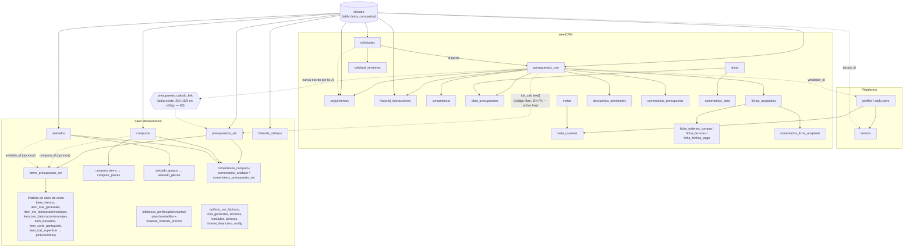

# Árbol de entidades — Steel Platform (steelCRM · Steel Measurement · backend compartido)

**Para:** cualquier sesión de Claude Code trabajando en steelCRM, Steel Measurement o
steel-backend, y cualquier documento de manual/instalación/arquitectura que se
construya a partir de este.
**De:** sesión de documentación (`steelCRM - BUILDIING`)
**Fecha:** 2026-08-25
**Fuente:** relevado directo contra el código real — las 24 migraciones SQL de
`steel-backend/supabase/migrations/`, `steelcrm/src/utils/storage.js` y
`steel-measurement/src/utils/storage.js` — no reconstruido de memoria ni del
changelog. Si algo de acá no coincide con el código actual, el código manda:
este documento quedó desactualizado y hay que corregirlo (ver §8).

**Por qué existe:** los dos sistemas (steelCRM, Steel Measurement) y el
backend compartido (steel-backend/Supabase) crecieron con ~48 tablas entre
los tres, casi todas agregadas de forma incremental durante agosto 2026. No
existía hasta ahora un mapa único de qué entidad vive dónde, cómo se
relaciona con qué, y qué vínculo real (no aspiracional) existe hoy entre los
dos sistemas. Sirve de base para manuales de uso, descripción técnica, y
como insumo directo para la auditoría de usabilidad/interdependencia que
tiene pendiente la sesión de Testing.

---

## 1. Los tres niveles del modelo de datos

Cada entidad de negocio existe en hasta tres formas distintas, y no siempre
con el mismo nombre:

1. **Estado local en React** (steelcrm/steel-measurement) — arrays en
   `localStorage`, fuente de verdad real hoy. Nombres en camelCase
   (`clienteId`, `idsCalc`, `dbId`).
2. **Fila en Supabase** — mismas entidades, nombres en snake_case, con
   `tenant_id` (multi-tenant) y `id` propio (uuid).
3. **El puente entre 1 y 2**: cada entidad local que ya se sincronizó guarda
   su `dbId` (el `id` de Supabase) para poder actualizar la fila correcta en
   vez de crear una nueva cada vez. Las funciones `xToDB`/`xFromDB` en cada
   `storage.js` hacen la traducción de nombres y de forma en los dos
   sentidos. Ver §7 para el patrón completo (dual-write, Fase 5, soft-delete).

Este documento describe el modelo desde el nivel 2 (Supabase) porque es el
más estable y el que cruza los dos sistemas — con nota de a qué entidad
local y a qué función de `storage.js` corresponde cada tabla.

---

## 2. Plataforma y multi-tenant

| Tabla | PK | FKs | Notas |
|---|---|---|---|
| `tenants` | `id` | — | Una fila por empresa cliente del SaaS. Hoy solo existe el tenant de MMN. |
| `profiles` | `id` (= `auth.users.id`) | `tenant_id → tenants` | El usuario real de Supabase Auth. `rol` en (`admin`,`supervisor`,`vendedor`). No tiene trigger de `tenant_id` automático (se crea explícito al alta, antes de que exista sesión). |
| `tenant_settings` | (`tenant_id`,`key`) | `tenant_id → tenants` | Config libre por tenant, `value jsonb`. Uso actual: mínimo/sin uso confirmado en UI todavía. |

**RLS**: casi todas las tablas de negocio tienen policy `tenant_id =
current_tenant_id()` (función `security definer` que lee `profiles` del
usuario autenticado) y un trigger `before insert` (`set_tenant_id_from_auth`)
que completa `tenant_id` solo si vino null — así ningún `toDB` del frontend
necesita pasarlo a mano.

**FKs a `profiles`** (o sea, todo lo que se puede asignar a una persona del
equipo) — lista completa, relevante para permisos/asignación:

- `presupuestos_crm.vendedor_id`
- `descuentos_pendientes.solicitado_por`, `descuentos_pendientes.resuelto_por`
- `solicitudes.asignado_a`
- `meta_usuarios.profile_id`
- `computos.vendedor`, `anidados.vendedor`, `presupuestos_sm.vendedor`, `historial_trabajos.vendedor`

---

## 3. Diagrama general

**Cómo leer las líneas punteadas**: son vínculos débiles o no wireados
(`ids_calc` es texto libre sin integridad referencial; `presupuesto_calculo_link`
es una tabla real pero ningún código la lee ni la escribe hoy — ver §6).
Las líneas sólidas son foreign keys reales con integridad referencial en
Postgres.

---

## 4. steelCRM — entidades y relaciones

| Tabla | PK | FKs | Local↔DB (`storage.js`) | Soft-delete | Notas |
|---|---|---|---|---|---|
| `presupuestos_crm` | `id` | `cliente_id→clientes`, `vendedor_id→profiles`, `recotizacion_de_id→presupuestos_crm` (self) | `presupuestoCrmToDB`/`FromDB`, `savePresupuestoCrmDB` | ✅ (`eliminado`, `eliminado_por`, `eliminado_fecha`) | Entidad central. `nro` único por tenant. `ids_calc text[]` — ver §6. `estado_nativo` es el estado comercial (7 valores); no confundir con `estado_sm` de Steel Measurement, que es solo informativo. |
| `comentarios_presupuesto` | `id` | `presupuesto_id→presupuestos_crm` | `comentarioToDB`/`FromDB` (genérica, `table` param) | ✅ (`eliminado`, `eliminado_por`) | Guardado directo al comentar, no espera al botón Guardar general. |
| `descuentos_pendientes` | `id` | `presupuesto_id→presupuestos_crm`, `solicitado_por→profiles`, `resuelto_por→profiles` | `descuentoToDB`/`FromDB`, `saveDescuentoDB` | — (usa `estado`: `pendiente`/`aprobado`/`rechazado`, nunca se borra) | Es el único historial de descuentos del sistema — no se borra al resolver. |
| `seguimientos` | `id` | `cliente_id→clientes`, `presupuesto_id→presupuestos_crm`, `solicitud_id→solicitudes` | `seguimientoToDB`/`FromDB` | ✅ | Agenda comercial. |
| `historial_interacciones` | `id` | `cliente_id→clientes`, `presupuesto_id→presupuestos_crm` | `interaccionToDB`/`FromDB` | ✅ | |
| `competencia` | `id` | `presupuesto_id→presupuestos_crm` | `competenciaToDB`/`FromDB` | — | Análisis de presupuestos perdidos. |
| `obras` | `id` | — | `obraToDB`/`FromDB` | ✅ | |
| `obra_presupuestos` | `id` | `obra_id→obras`, `presupuesto_id→presupuestos_crm` | `saveObraPresupuestosDB`/`syncObraPresupuestosDB` | — | Tabla de vínculo. El esquema permite muchos-a-muchos (`unique(obra_id, presupuesto_id)`) pero la UI actual (`BudgetModal`) solo deja un presupuesto vinculado a **una** obra a la vez — se desvincula de la anterior antes de vincular la nueva. |
| `solicitudes` | `id` | `cliente_id→clientes`, `asignado_a→profiles`, `presupuesto_id→presupuestos_crm` | `solicitudToDB`/`FromDB` | ✅ | Solicitud entrante con scoring IA. Al "ganar" se referencia el presupuesto creado. |
| `solicitud_versiones` | `id` | `solicitud_id→solicitudes` | `versionSolicitudToDB`/`FromDB` | — | |
| `metas` | `id` | — | `metaToDB`/`FromDB` | — | Meta de equipo o individual. |
| `meta_usuarios` | `id` | `meta_id→metas`, `profile_id→profiles` | `saveMetaUsuariosDB`/`loadMetaUsuariosDB` | — | Solo se llena cuando la meta es individual (`asignadoA` array, no `"todos"`); solo alcanza a usuarios que ya iniciaron sesión real al menos una vez. |
| `fichas_aceptados` | `id` | `presupuesto_id→presupuestos_crm` (unique — 1:1) | `fichaAceptadoToDB`/`FromDB` | ✅ | Ficha administrativa/de producción de un presupuesto aceptado. |
| `ficha_ordenes_compra`, `ficha_facturas`, `ficha_fechas_pago` | `id` c/u | `ficha_id→fichas_aceptados` | `saveDocumentosFichaDB` (reemplazo total por lote) | — | Los 3 documentos de una ficha. |
| `comentarios_obra` | `id` | `obra_id→obras` | `comentarioToDB` (genérica) | ✅ | Mismo componente compartido `ComentariosThread` que presupuestos. |
| `comentarios_ficha_aceptado` | `id` | `ficha_id→fichas_aceptados` | `comentarioToDB` (genérica) | ✅ | |

---

## 5. Steel Measurement — entidades y relaciones

| Tabla | PK | FKs | Local↔DB (`storage.js`) | Soft-delete | Notas |
|---|---|---|---|---|---|
| `presupuestos_sm` | `id` | `cliente_id→clientes`, `clonado_de_id→presupuestos_sm` (self), `vendedor→profiles` | `loadDBPresupuestosSM`/`saveDBPresupuestoSM` | ✅ | `codigo_calculo` es el identificador que exporta a steelCRM (§6) — antes NOT NULL, hoy nullable (presupuestos históricos sin uno). `estado` (4 valores: `borrador/enviado/aprobado/rechazado`) es un vocabulario **distinto** al `estado_nativo` de steelCRM — nunca se mapean 1:1. |
| `items_presupuesto_sm` | `id` | `presupuesto_id→presupuestos_sm`, `computo_id→computos` (opcional), `anidado_id→anidados` (opcional) | `loadDBItems`/`saveDBItem` | — | Un ítem puede traer material de un cómputo o de un anidado, no ambos a la vez en general. |
| `item_hierros`, `item_mat_generales`, `item_mo_fabricacion`, `item_mo_montajes`, `item_terc_fabricacion`, `item_terc_montajes`, `item_traslados`, `item_corte_pantografo` | `id` c/u | `item_id→items_presupuesto_sm` | dentro de `saveDBItem` | — | Los 9 rubros de costo por ítem (8 tablas de línea + 1 de tratamiento). |
| `item_trat_superficie` | `id` (unique por item) | `item_id→items_presupuesto_sm` (1:1) | dentro de `saveDBItem` | — | `item_trat_pinturas`/`item_trat_otros` cuelgan de esta, no directo del ítem. |
| `item_trat_pinturas`, `item_trat_otros` | `id` c/u | `trat_id→item_trat_superficie` | dentro de `saveDBItem` | — | |
| `computos` | `id` | `cliente_id→clientes`, `vendedor→profiles` | `loadDBComputos`/`saveDBComputo` | ✅ | `categoria`/`tipo_trabajo` viajan de acá hacia Anidado y Presupuesto (traspaso automático, no piso lo ya cargado a mano). |
| `computo_items` | `id` | `computo_id→computos` | dentro de `saveDBComputo` | — | |
| `computo_piezas` | `id` | `computo_item_id→computo_items` | dentro de `saveDBComputo` | — | Perfil o plancha, con % de granallado/pintura/galvanizado y corte por máquina. |
| `anidados` | `id` | `cliente_id→clientes`, `vendedor→profiles` | `loadDBAnidados`/`saveDBAnidado` | ✅ | |
| `anidado_grupos` | `id` | `anidado_id→anidados` | dentro de `saveDBAnidado` | — | `resultado jsonb` = salida calculada del algoritmo de optimización de corte (única columna jsonb "libre" del esquema, a propósito). |
| `anidado_piezas` | `id` | `grupo_id→anidado_grupos` | dentro de `saveDBAnidado` | — | |
| `historial_trabajos` | `id` | `cliente_id→clientes`, `vendedor→profiles` | `loadDBHistorialTrabajos`/`saveDBTrabajoHistorico` | ✅ | Benchmark: % de cada rubro sobre el total (`pct_hier`, `pct_mat`, `pct_mo_fab`, etc.) — insumo de Predictor Eq. |
| `biblioteca_perfiles`, `biblioteca_planchuelas`, `biblioteca_planchas`, `biblioteca_rejillas` | `id` **text**, no uuid | — | `loadDBBiblioteca`/`saveDBMaterial` | — | Únicas 4 tablas de todo el esquema con `id` no-uuid: usan el código de catálogo legible (`"HEB100"`) como identidad estable a propósito, para poder matchear contra el catálogo semilla en cualquier instalación. |
| `material_historial_precios` | `id` | `material_id` (text, sin FK real — referencia lógica a una de las 4 tablas de arriba según `material_tipo`) | `loadDBHistorialPrecios` | — | |
| `tarifario_mo_fab`, `tarifario_mo_mon`, `tarifario_mat_generales`, `tarifario_terceros`, `tarifario_traslados`, `tarifario_pinturas`, `tarifario_interes_financiero` | `id` c/u | — | `loadDBTarifario`/`saveDBTarifario` | — | |
| `tarifario_config` | `tenant_id` (PK directa) | `tenant_id→tenants` | `loadDBTarifario`/`saveDBTarifario` | — | Única fila por tenant (no lista): `arenado_usd_m2`, `galvanizado_usd_kg`, `panto_usd_kg_2d/3d`. |
| `comentarios_computo`, `comentarios_anidado`, `comentarios_presupuesto_sm` | `id` c/u | `computo_id→computos` / `anidado_id→anidados` / `presupuesto_id→presupuestos_sm` | `saveDBComentario` (genérica) | — | Guardado directo al comentar (diseño original de Steel Measurement, luego replicado a steelCRM). |

---

## 6. El vínculo cruzado steelCRM ↔ Steel Measurement

Hay **dos mecanismos** en el esquema, y solo uno está activo:

1. **`presupuestos_crm.ids_calc` (`text[]`) — el que se usa hoy.**
   Texto libre, sin foreign key. Se llena de dos formas: (a) a mano, campo
   "ID Cálculo(s)" en `BudgetModal`; (b) al usar "Cargar desde Steel
   Measurement" en `Importar.jsx`, que hace *append* del `codigo_calculo`
   exportado. Es deliberadamente débil — el código de cálculo puede ser
   histórico/manual sin ninguna fila real de `presupuestos_sm` detrás
   (presupuestos de antes de que existiera Steel Measurement).

2. **`presupuesto_calculo_link` — existe en el esquema, sin usar.**
   Tabla real (`presupuesto_crm_id`, `presupuesto_sm_id`, ambas FK con
   integridad referencial real) creada en la migración
   `20260822120300_link_table.sql`, pensada para reemplazar el mecanismo de
   arriba con un vínculo verdadero cuando Steel Measurement pase un cálculo
   real al CRM. **Confirmado por grep en ambos repos: ningún componente la
   lee ni la escribe todavía.** Decisión explícita de Gino (2026-08-24): no
   wirearla hasta que exista ese flujo concreto — no es un bug, es
   intencional.

**Si una sesión futura conecta esta tabla**, actualizar esta sección y la
línea correspondiente del diagrama en §3.

**El otro vínculo real, más simple**: `clientes` es una tabla **única**,
compartida entre los dos sistemas (no hay `clientes_crm`/`clientes_sm`) —
un cliente cargado desde cualquiera de los dos aparece en el otro.

---

## 7. Patrón local↔DB (dual-write, `dbId`, soft-delete)

- **localStorage sigue siendo la fuente de verdad** en ambos sistemas. Cada
  guardado local dispara además una escritura a Supabase en paralelo
  (dual-write) que nunca puede bloquear ni romper el guardado local si
  falla (sin internet, Supabase caído).
- **`dbId`**: cuando una entidad local se sincroniza por primera vez, el
  `id` que devuelve Supabase se guarda de vuelta en el registro local como
  `dbId` — así la próxima escritura hace `UPDATE` en vez de crear una fila
  nueva. Un registro creado offline o migrado desde antes de Fase 3 puede
  no tener `dbId` todavía.
- **Fase 5 (lectura desde la nube)**: al montar la app, cada entidad
  también trae lo que exista en Supabase y no esté ya en localStorage
  (creado desde otro dispositivo/sesión) — nunca reemplaza ni pisa un
  registro local, nunca deja al usuario sin datos si falla la lectura.
- **Soft-delete**: las entidades marcadas ✅ en §4/§5 nunca se borran de
  verdad — se marcan `eliminado = true` (+ `eliminado_por`, `eliminado_fecha`
  donde aplica) y se filtran de las vistas activas. Recuperables desde una
  pantalla de Papelera (admin-only). El resto de las tablas (sub-tablas de
  detalle: piezas, rubros de costo, comentarios en algunos casos) no tiene
  soft-delete propio — se administran junto con su padre.

---

## 8. Mantenimiento de este documento

Este archivo es la fuente de verdad del modelo de datos compartido — junto
con `TAXONOMIA-COMPARTIDA-MMN.md` (Familia/Categoría) y
`BACKEND-COMPARTIDO-MMN.md` (diseño de fase 0 del backend, más narrativo,
este documento es el que queda al día con el esquema real).

**Regla de sync** (steelCRM: `CLAUDE.md` regla 9 · Steel Measurement:
`PLAN.md` §11 punto 7 · steel-backend: `CLAUDE.md` regla 9): toda sesión
que agregue, borre o modifique una tabla, columna o relación en
`steel-backend/supabase/migrations/`, o que cambie qué entidad local mapea
a qué tabla en `storage.js`, actualiza la sección correspondiente de este
documento en el mismo commit — mismo criterio que ya rige para el
changelog de cada proyecto.
